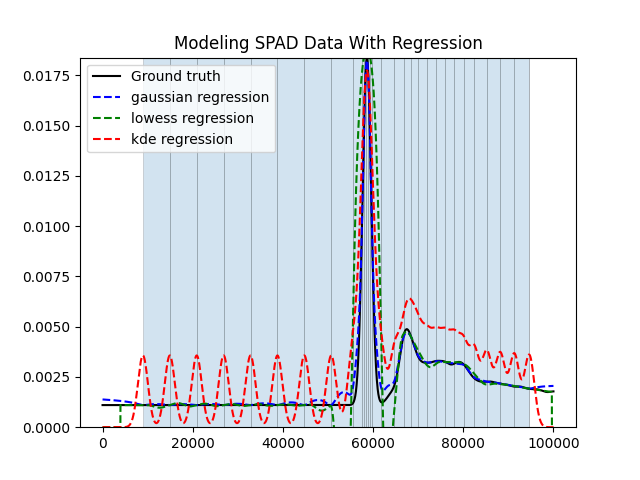

# SPAD Regression Research


------------------------------------------------------------------------
This repository contains various tests and jupyter notebook experimentations with various
regression algorithms, mainly non-parametic, in order to better model the response curves of
SPAD sensors from both EWH and EDH datasets\
\
*Figure 1: Example graph of each regression model plotted against ground-truth data*

## Motivation
The use of equi-depth histograms (EDH) to model photon arrival times in SPAD sensors for single-photon 3D cameras has greatly improved the accuracy of identifying the precise depth value of an object in a scene. Additionally, EDH also allows for much smaller binning requirements in order to accurately model depth levels, thus decreasing the amount of data needed to process each pixel in the image. Despite this, there are still issues with solely using EDH data to estimate depth and saturation, mainly the limited amount of actual depth levels that can be extracted from datasets with smaller bin sizes. The use of non-parametic regresssion equations as proposed both here and in the writeup hope to remedy this by allowing for estimation of photon counts at any point in the camera's exposure time. This not only allows for obtaining more information about the object captured by each pixel (such as reflectivity of the object and other sources of ambient light), but also allows for more potential depth levels for even smaller sized equi-depth bins. 

## Installation
The project can be installed using git via:
```bash
git clone https://github.com/elcosas/SPAD_Regression_Research.git
```
All libraries required for installation can be installed through pip using `max_requirements.txt`
```bash
pip install -r max_requirements.txt
```
or by using `min_requirements.txt` to avoid installing Jupyterlab dependencies
```bash
pip install -r min_requirements.txt
```
To get started, `cd` into the `src` folder and run:
```bash
python3 example.py 0
```
to generate the same graph shown in *Figure 1*!

## Usage (Notebooks)
First, once inside the project folder, use `cd notebooks` to change to the notebooks directory. The notebooks contain the various expermentations done with the sample data provided as well as 
different parametic and non-parametic regression methods tested with the sample data. the notebooks themselves can be viewed by running `jupyter lab` and then opening `localhost:8888/lab/` in your
prefered browser

## Usage (Scripts)
The repository also contains various scripts that can be used to plot the three regression models on various datasets, generate error statistcs files for the regression models,
and create depth maps using these models. First, use `cd src` to change to the scripts directory and run any of the following scripts:

### `edh_test.py` & `ewh_test.py`:
These scripts generate the histogram, equi-depth or equi-width respectively, of the transients passed as arguments and plots the passed regression method in comparison with the ground-truth data.
These can be run with:
```bash
python3 edh_test.py {model name} {operation name} {set #}
```
```bash
python3 ewh_test.py {model name} {operation name} {set #}
```
Where:\
`model name`: the regression model to test, either "gaussian", "lowess", or "kde" (note: kde is not avalible for equi-width tests)\
`operation name`: the test type to run, either "single" to generate a single graph, or "all" to generate a zip file of all the graphs in the transients dataset\
`set #`: the dataset # to use (scales from 0-29 for the data in `./dataset`)

### `error_test.py`:
This script generates two .csv files, one for EWH data and EDH data, with error statistics for all three regression equations. These include the coefficient of determination,
mean squared error, maximum error, and peak error (error between maximum values). it can be run with:
```bash
python3 error_test.py {set #}
```
Where:\
`set #`: the dataset # to use (scales from 0-29 for the data in `./dataset`)

### `mk_image.py`:
This script generates a depth map from the equi-depth boundaries of a 3-dimensional .npy file of image data. it can be run with:
```bash
python3 mk_image.py {file name}.npy {model name}
```
Where:\
`file name`: the file name of the 3-dimensional .npy file\
`model name`: the regression model to test, either "gaussian", "lowess", or "kde" (note: kde is not avalible for equi-width tests)

## Write-up installation
The .pdf of the paper can built by running `cd paper` to move to the `paper` directory, then running `make build` to compile the .tex file into a .pdf
(this assumes LaTeX is installed, if not run `sudo apt install texlive-latex-recommended`). Any extraneous files can be removed by running `make clean`

## Attributions and License
This project is licensed under the [GNU General Public License v3.0](https://www.gnu.org/licenses/gpl-3.0.en.html)
